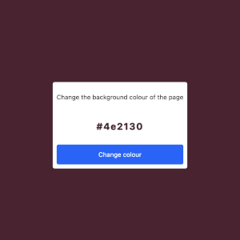

# Colour flipper

This is a practice project to apply some beginner knowledge about DOM manipulation using JS. A simple colour flipper that lets you randomly change the background colour of the page's body. 

## Getting started

Just click on the "Change colour" button and see the result.

## Technologies
This project is created with:

* HTML
* CSS
* JavaScript

## Credits

Named colours from [w3schools](https://www.w3schools.com/colors/colors_hex.asp).
